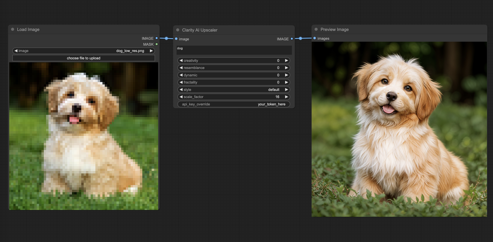

# Clarity AI node for ComfyUI

This is a ComfyUI node for Clarity AI, the creative image upscaler. It upscales and enhances images to high resolution.



## Free Usage:

We now have a fully ComfyUI workflow of Clarity upscaler, it seems to uses the same tech and is getting close to the clarity results. Needs some final tweaking to reach the same quality.
Feel free to experiment and let me know if you discover great parameters.

### 1. Install

Just drag and drop the `free-workflow.json` workflow json file into your ComfyUI

## Simple but paid usage:

### 1. Install Clarity AI node

Open ComfyUI Manager, search for Clarity AI, and install the node.

Alternatively:

```bash
cd custom_nodes
git clone https://github.com/philz1337x/ComfyUI-ClarityAI
```

### 2. Create your API key

Create an API key at: https://clarityai.co/comfyui

### 3. Add the key to the node

Add the API key to the environment variable "`CAI_API_KEY`"

Alternatively, you can write your API key to a "`cai_platform_key.txt`" text file in the ComfyUI-ClarityAI folder.

Not recommended: You can also use and/or override the above by entering your API key in the '`api_key_override`' field. But be careful to delete the api_key_override when sharing your workflow.

<!--
A) Drag and drop this image, with the workflow inside, into ComfyUI and install missing nodes. -->
<!--  -->
