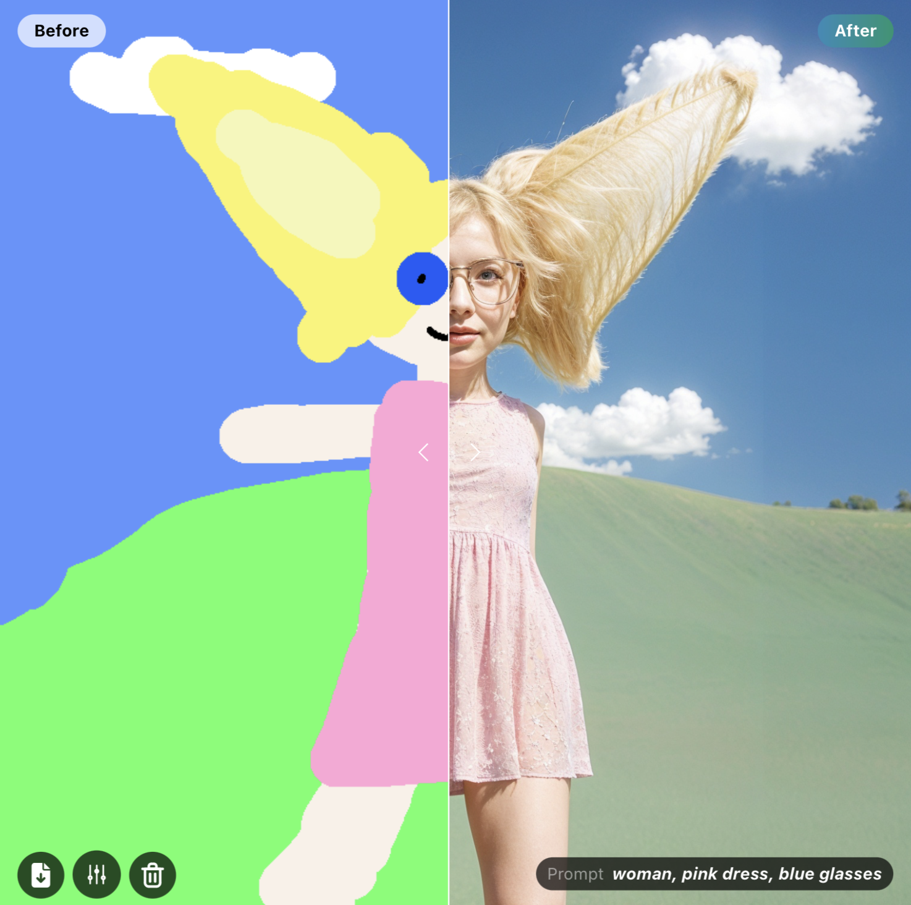

# Clarity AI node for ComfyUI

This is a ComfyUI node for Clarity AI, the creative image upscaler. It upscales and enhances images to high resolution.



## Usage:

### Create an API key

Create an API key for your Clarity AI account at: https://clarityai.cc/api

### Add the key to the node

Add the API key to the environment variable "`CAI_API_KEY`"

Alternatively, you can write your API key to a "`cai_platform_key.txt`" text file in the ComfyUI-ClarityAI folder.

Not recommended: You can also use and/or override the above by entering your API key in the '`api_key_override`' field. Be careful when sharing your workflow.

### Add the Clarity AI node

You have three options to install this custom node:

A) Drag and drop this image, with the workflow inside, into ComfyUI and install missing nodes.


B)

```bash
cd custom_nodes
git clone https://github.com/philz1337x/ComfyUI-ClarityAI
```

C) Open ComfyUI Manager, search for Clarity AI, and install the node.
